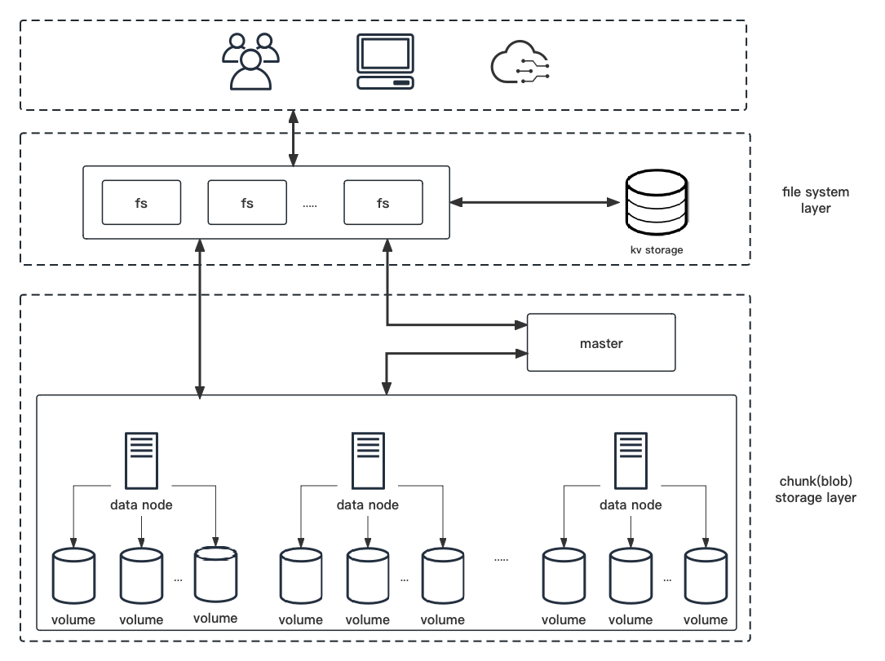

# youngfs

yougfs is an append-only distributed file storage system, developed using Golang and based on the Google File System (GFS) model. It is designed to be simple and easily extensible, featuring:

- **Append-Only Data Model**: Ensures efficient data storage and retrieval.
- **Data Protection**: Utilizes [ReedSolomon coding](https://en.wikipedia.org/wiki/Reed–Solomon_error_correction) for redundancy and backup, safeguarding against data loss.
- **Flexible Data Access**: Provides various methods for data access to suit different requirements.
- **Meta Data Storage**: Inspired by [Facebook Tectonic](https://www.usenix.org/system/files/fast21-pan.pdf) and object storage models, supporting multiple KV stores like Badger, RocksDB, and TiKV.
- **Chunk Storage Engine**: Based on [Facebook Haystack](https://www.usenix.org/legacy/event/osdi10/tech/full_papers/Beaver.pdf) design for the underlying chunk storage engine, supporting multiple storage backends.

This project aims to provide a robust and scalable solution for managing large datasets with reliability and efficiency.

## Storage Model

yougfs utilizes a distributed and scalable data storage model, offering an append-only approach to data management that is accessible via an HTTP interface and a web page for operations such as creation, deletion, and retrieval. This model, by being append-only, makes simple read and write operations more straightforward and efficient, though it shares a limitation with object storage in that it does not easily accommodate modifications to files; any change requires rewriting the file in its entirety. The system's architecture facilitates scalability through multiple file system layer services that manage access requests, all while handling the significant computational and bandwidth demands inherent in such a system. Metadata is unified within a key-value database, allowing these distributed services to operate seamlessly as a single cluster. Moreover, the chunk storage component is managed by a master controller, overseeing the state of each volume server and ensuring the system's capacity for expansion without sacrificing performance or reliability. This model underscores yougfs's commitment to providing a robust, scalable solution for efficient and reliable large-scale data management.

## Data Protection

yougfs ensures data protection by implementing Reed-Solomon redundancy and backup strategies, optimizing the approach based on the size of the files to enhance storage efficiency and reduce the impact on disk performance due to random read/write operations.

- **Large Files**: For larger files, yougfs employs Reed-Solomon redundancy. The system divides each large file into multiple chunks and applies erasure coding to each chunk, creating several fragments. This ensures that each fragment is stored on a different volume server, thereby enhancing data availability and reliability by distributing the data across multiple physical locations.

- **Small Files**: In the case of smaller files, yougfs opts for a direct backup strategy. This approach is chosen to minimize the disk performance impact, bypassing the overhead associated with redundancy calculations for data that might not require such extensive protective measures.

This tailored strategy for data protection ensures that yougfs can provide robust data safety measures while maintaining efficient and reliable storage management, regardless of the file size.

## Metadata Design

The design of metadata within yougfs draws inspiration from Facebook's Tectonic architecture and the design language of object storage systems. This approach enables the system to achieve efficiency and performance in common file operations that are comparable to those found in traditional file systems. Specifically tailored for individual file access, this design ensures high efficiency and rapid response times, making it particularly suited for web data access and large-scale data storage applications.

While this metadata design approach significantly boosts the performance of single file operations, it's important to note that it may result in decreased performance for operations involving entire directories. However, the trade-off is considered acceptable within the context of yougfs's primary use cases, which prioritize web data access and the needs of big data storage over traditional directory operations. This design choice reflects yougfs's commitment to providing a robust, scalable solution for modern data management challenges.

## Chunk Storage

The chunk storage mechanism in yougfs is divided into two main components: the master and volume services. This structure plays a critical role in the overall architecture and efficiency of the system.

- **Master Service**: The master service's primary function is to keep track of the status of each volume server, determining whether it's online, and to maintain basic information about each data volume. This information is crucial for facilitating data migration and service recovery processes, ensuring that the system can maintain high availability and resilience in the face of hardware failures or other disruptions.

- **Volume Service**: Inspired by the Facebook Haystack model, the volume service focuses on the efficient storage of data. It achieves this efficiency by aggregating multiple small fragments (frags) into a single large file and using simple offset values to record the specific information of individual fragments. This approach significantly reduces the overhead associated with accessing the local filesystem's directory structure, enhancing performance and scalability. By compressing data in this manner, yougfs minimizes the impact of directory traversal and lookup times, making it more efficient in handling large volumes of data.

The combination of the master and volume services within the chunk storage component of yougfs exemplifies the system's commitment to efficiency, reliability, and scalability. By adopting and adapting proven models like Facebook Haystack, yougfs ensures a robust foundation for managing and storing large datasets.
